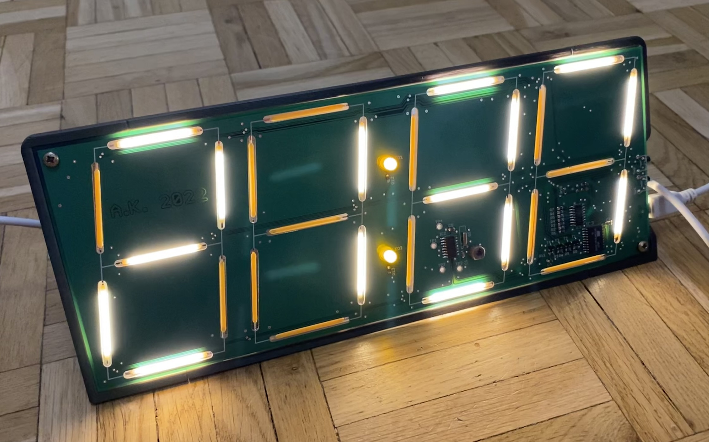

# LEDclock
Big DIY clock based on LED filaments.
# Introduction
LEDclock project is a simple, yet very big and bright clock based on chinesium 3V LED filaments (designed to look like a incadescent bulb tungsten filament... from the distance, I guess).  

# Features
- 24 hour clock,
- time setting via two buttons (one for minutes, one for hours),
- long press button to set time faster,
- blinking after power loss to indicate that the time is incorrect,
- RTC calibration with 1 ppm precision (+- 999 ppms),
- slow, gradual enabling/disabling changed screen segments (PWM),
- brightness setting,
- watchdog,
- calibration and brighness storage on the EEPROM.
# How to
To increment minutes press upper button, to increment hours press lower button. Long press for fast change
Press both buttons long to change mode. Available modes:
- RTC calibration,
- brightness setting,
- normal operation (clock mode).
After 5 seconds of buttons not being pressed display will return to clock mode.
## RTC calibration
Display: Cxxx for positive (making clock faster), Exxx for negative calibration. Press upper button to increase calibration value, lower button to decrease. Allows calibration from -999 to 999 ppm.
## Brighness
Display: b  x. Press upper button to increase brightness, lower to decrease. Brightness levels from 0 to 8 are available.
# I want to build one!
That's great! I am providing everything you need to make one yourself.
## Making PCB
Send gerber files to the PCB manufactuer of your choice. Make sure to get 28 milled slots done - it is essential, as LEDs are mounted on the bottom side and are viewed from the top side.
## Collecting elements
Please see the bom.csv file with all needed components. You can get LED filaments from here https://pl.aliexpress.com/item/4000478265055.html. Make sure to get 3V version!
## Soldering
This project uses pretty much only SMD elements, but all of them can be mounted using basic soldering iron.
**Dot LEDs can interfere with the ISP interface (depending on the programmer)!** Mount R12 and R13 resistors *after* downloading FW to the board. 
Watch out for LED filaments polarisation. + side is marked by a small hole in the lead - solder this side to the "common" side (the side that is connected to the neighbour LEDs).
## Sofware needed
To build FW you need *avr-gcc* along with *avr-libc*. To download the FW to the MCU you need *avrdude*.
## Downloading FW
My suggestion is to use USBasp programmer and avrdude software tool. I've provided needed commands in Makefile.
First we need to set fuse byte to change default 1 MHz CPU clock to 8 MHz: 
*make fuse* 
then we can download FW: 
*make install* 
Done! The clock should now be ready to be used.
## Housing 3D print
Housing is too big for most 3D printers to fit, so it was designed to be able to split into 3 parts. You need to split 30 mm on both sides. Three pieces can then be reattached by using 4 M4x25 (conical head) and 2 M3x50 screws. Many other screw lengths will do the trick. PCB is attached to the housing using 2 M3x8 screws.  

## Filter
LED filaments give huge brightness but poor constrast - filter is needed. Print 4 times *filter.stl*, use dark filament for best result, 0.2 mm layer height. Put them into slots on the top side and hold them in place with a little drops of superglue. 
Screen without the filters: 

# License
Free for non-commercial use and educational purposes. See LICENSE.md for details.
# Donations
If you like my project and would like to endorse me, you can donate any BTC amount to the address:  
3EL4b7g72awqXzzVFQan2h2PmizMhSSYMX  

# Photos
  

